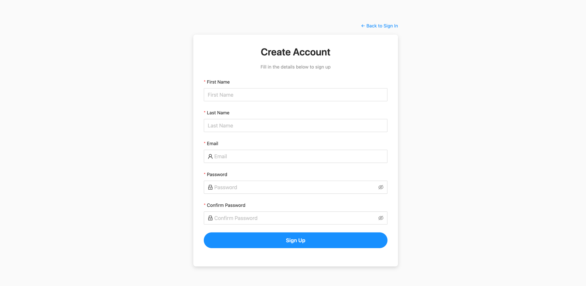
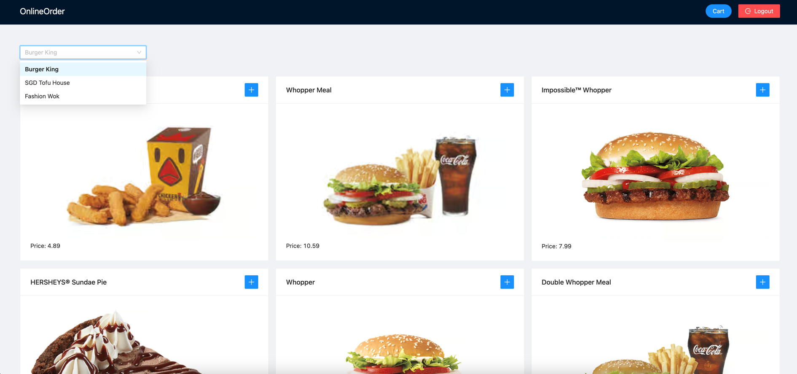
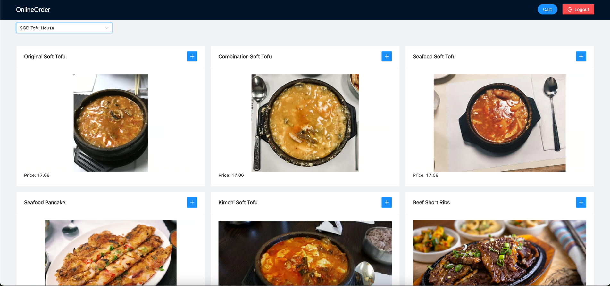
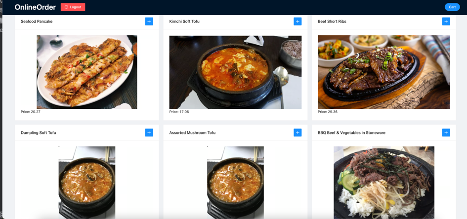
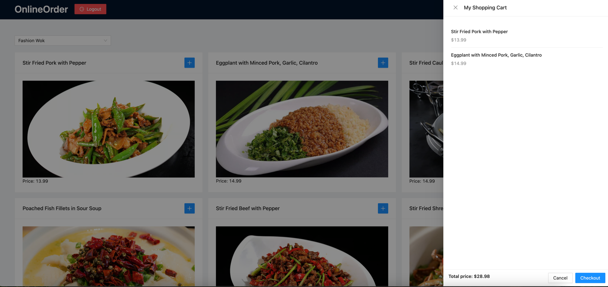

# OnlineOrder
A Spring Boot and React-based ordering system

# Project Introduction

The OnlineOrder system is a food ordering platform that connects customers with restaurants, built on SpringBoot and deployed using Docker. The customer-facing system features restaurant discovery, menu browsing, cart management, and checkout functionality, while the management interface allows restaurants to manage menus, process orders, and track customer data.

## Future Enhancements

Planned additions include:

1. **Payment Integration** - Secure payment processing supporting multiple payment methods.

2. **Coupon System** - Promotional discounts with coupon code generation and redemption tracking.

3. **VIP Membership** - Tiered membership with benefits like priority ordering, exclusive discounts, and free delivery options.

These enhancements will improve user experience and provide additional value to both customers and restaurant partners.
## Technology Stack
### Backend Technologies

| Technology | Description | Official Website |
| --- | --- | --- |
| Spring Boot | Web application development framework | [https://spring.io/projects/spring-boot](https://spring.io/projects/spring-boot) |
| Spring Data JDBC | Database access framework | [https://spring.io/projects/spring-data-jdbc](https://spring.io/projects/spring-data-jdbc) |
| Spring MVC | Web framework | [https://docs.spring.io/spring-framework/reference/web/webmvc.html](https://docs.spring.io/spring-framework/reference/web/webmvc.html) |
| Spring Security | Authentication and authorization framework | [https://spring.io/projects/spring-security](https://spring.io/projects/spring-security) |
| Gradle | Dependency management tool | [https://gradle.org/](https://gradle.org/) |
| Java 21 | Programming language | [https://www.oracle.com/java/](https://www.oracle.com/java/) |
| Docker | Application containerization | [https://www.docker.com](https://www.docker.com) |
| JWT | Token-based authentication | [https://github.com/jwtk/jjwt](https://github.com/jwtk/jjwt) |
### Frontend Technologies

| Technology         | Description                              | Official Website                                  |
|--------------------|------------------------------------------|---------------------------------------------------|
| React              | JavaScript library for building UI       | https://reactjs.org/                              |
| Ant Design (antd)  | UI component library for enterprise apps | https://ant.design/                               |
| React Hooks        | React's built-in state and lifecycle API | https://reactjs.org/docs/hooks-intro.html         |

## Core Functional Modules
### User Management Module
- **Registration**: `/signup` (POST)
    - Accepts user credentials (email, password, name)
    - Creates new user accounts

### Shopping Cart Module
- **Retrieve Cart**: `/cart` (GET)
    - Retrieves current user's cart contents

- **Add to Cart**: `/cart` (POST)
    - Adds menu items to the shopping cart

- **Checkout**: `/cart/checkout` (POST)
    - Processes the order and clears the cart

## Data Model
### Primary Entities
- **CustomerEntity**: User information
- **CartEntity**: Shopping cart data
- **MenuItemEntity**: Menu item information
- **RestaurantEntity**: Restaurant details
- **OrderItemEntity**: Order item information

## Security Implementation
- Spring Security-based authentication and authorization
- Current user retrieval using `@AuthenticationPrincipal User`

## System Characteristics
1. RESTful API design pattern
2. Microservice architecture with frontend-backend separation
3. Built on Spring ecosystem
4. Docker containerization for deployment

## Deployment Environment
The system is containerized using Docker with docker-compose for orchestration, ensuring portability and rapid deployment capabilities.

